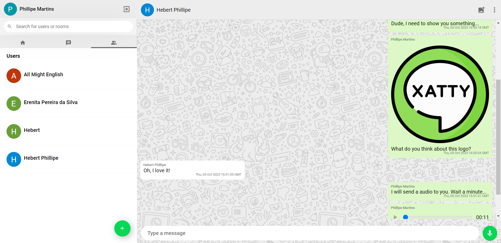
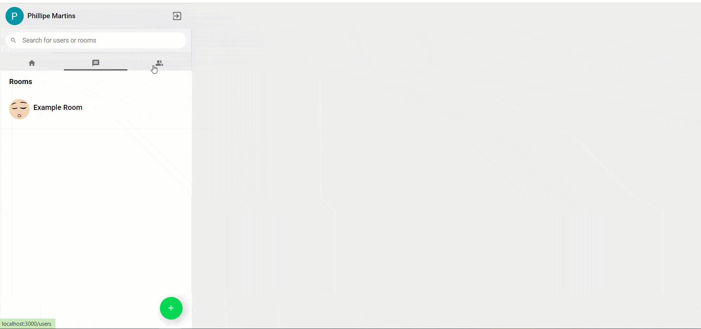
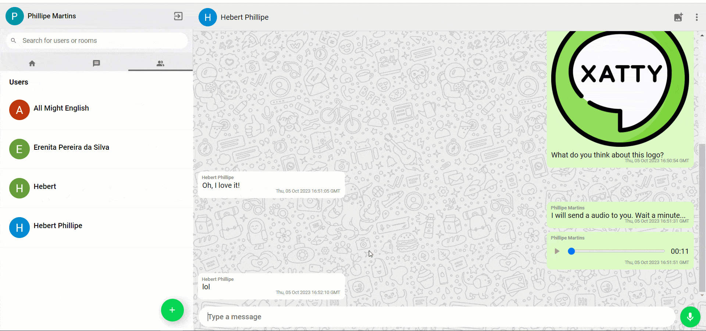
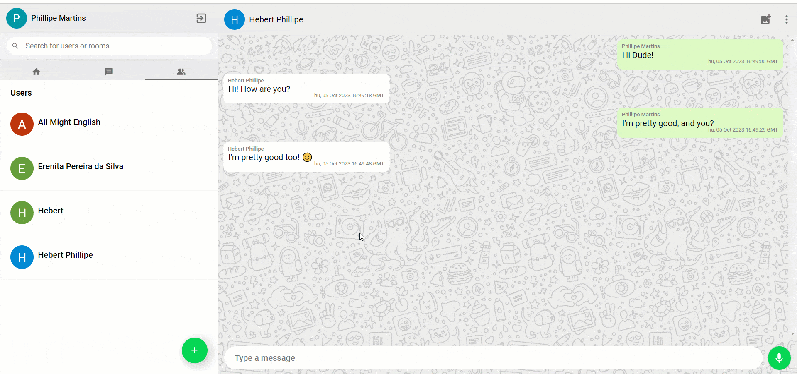
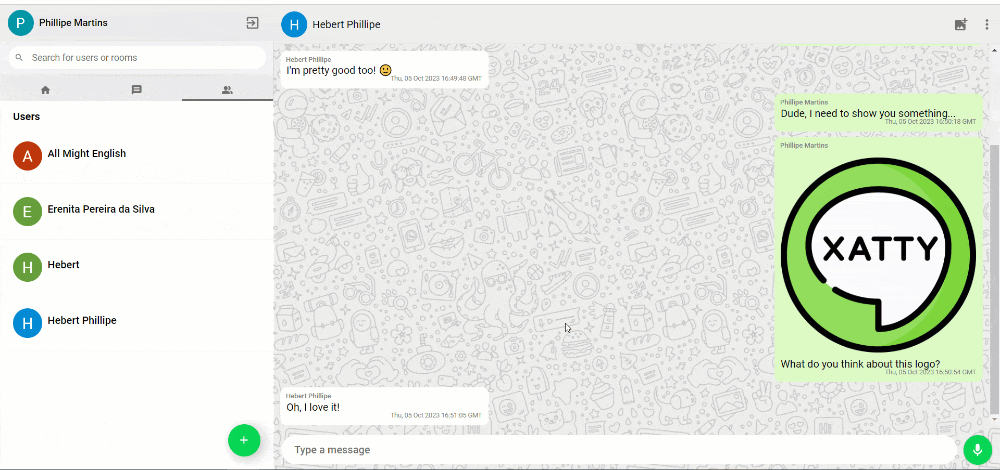

# Xatty - Chat App made with React <!-- omit in toc -->

Chat App with some cool features, like private and public rooms and supporting different message types (text, image and audio).


[](https://opensource.org/licenses/MIT)

<p align="center" >
    
</p>

## Summary <!-- omit in toc -->

- [Technologies Used](#technologies-used)
- [Features](#features)
  - [Google Auth](#google-auth)
  - [Rooms](#rooms)
    - [Private](#private)
    - [Public](#public)
  - [Message types](#message-types)
    - [Text](#text)
    - [Image](#image)
    - [Audio Recording](#audio-recording)
- [Architecture and Directories](#architecture-and-directories)
- [Local Configuration](#local-configuration)
- [Firebase Configuration](#firebase-configuration)
- [Possible Improvements](#possible-improvements)
- [Authors](#authors)
- [License](#license)

## Technologies Used

- [HTML](https://developer.mozilla.org/en-US/docs/Web/HTML) & [CSS](https://developer.mozilla.org/en-US/docs/Web/CSS)
- [Typescript](https://www.typescriptlang.org/)
- [React](https://react.dev/)
- [Material UI](https://mui.com/material-ui/) for design
- [Material Icons](https://mui.com/material-ui/material-icons/) for icons
- [Vite](https://create-react-app.dev/)
- [Firebase](https://firebase.google.com) for backend
- [NPM](https://www.npmjs.com/)
- [Github Actions](https://docs.github.com/en/actions) for CI/CD


## Features

### Google Auth

Allow users to sign in the app using their Google accounts. This provides a secure and convenient authentication method, ensuring that only authorized users can access the app's features.

<p align="center" >
    
</p>

### Rooms

#### Private

Private chat rooms where users can have one-on-one conversations. Private rooms are ideal for confidential or restricted discussions.

<p align="center" >
    
</p>

#### Public

Public chat rooms that are accessible to all users. Public rooms encourage open communication and allow anyone to join and participate in group discussions on various topics.

<p align="center" >
    
</p>

### Message types

#### Text

Allow users to send and receive text messages in real-time. Text messages are the foundation of communication in the application, allowing users to exchange written messages, express thoughts, and engage in discussions with ease.

<p align="center" >
    
</p>

#### Image

Allow users to upload images to share within chat rooms. This feature enhances communication by allowing participants to share visual content, such as photos, memes, or screenshots.

<p align="center" >
    
</p>

#### Audio Recording

Allow users to record and send voice messages. This feature adds a dynamic and interactive element to the chat application.

<p align="center" >
    
</p>

## Architecture and Directories

This section provides an in-depth overview of the structural design and organization of this codebase. It outlines the directories and components that make up the app's architecture, helping developers understand how the project is structured and how different parts of the application interact.

```
Project
├── .github
│   ├── workflows: Github Actions workflows
├── public: Public HTML, images, and other assets that are served as-is by the web server
├── src
│   ├── components: React components used throughout the app
│   ├── helpers: Custom utility functions
│   ├── hooks: Custom React hooks that can be reused across the app.
│   ├── vendor: Third-party or external libraries
│   ├── App.module.css: A CSS module file specific to the main app component
│   ├── App.tsx: Main app component
│   ├── main.ts: Main TS file
│   ├── styles.css: Global CSS styles
|── .env.example: Example environment variables file that developers can reference to set up their own environment variables for the app.
|── .eslintrc: ESLint project configuration.
|── .gitignore: Specifies files to Git ignore
|── .prettierrc: Prettier project configuration.
|── index.html: Main HTML file that serves as the entry point for your React app.
├── package.json: File that manages all the dependecies and contains script definitions.
|── tsconfig.json: TS configuration.
|── vite.config.ts: Vite configuration.
```

## Local Configuration

After cloning the project, enter in the project root and run the following command:

```sh
$ npm run setup
```

- By default the application will be started at port 3000.

## Firebase Configuration

...

## Possible Improvements

A system is never perfect and there is always room for improvement. Here are some points that I would like to enhance if I had more time:

- Create some tests
- Minor Ui fixes
- Finish the `Firebase Configuration` section

## Authors

|  |
| :----------------------------------------------------------------------------: |
|               [Phillipe Martins](https://github.com/inkasadev/)                |

See also the list of
[contributors](https://github.com/inkasadev/react-chat/contributors) who
participated in this project.

## License

This project is licensed under the MIT License - see the
[LICENSE.md](LICENSE.md) file for details

